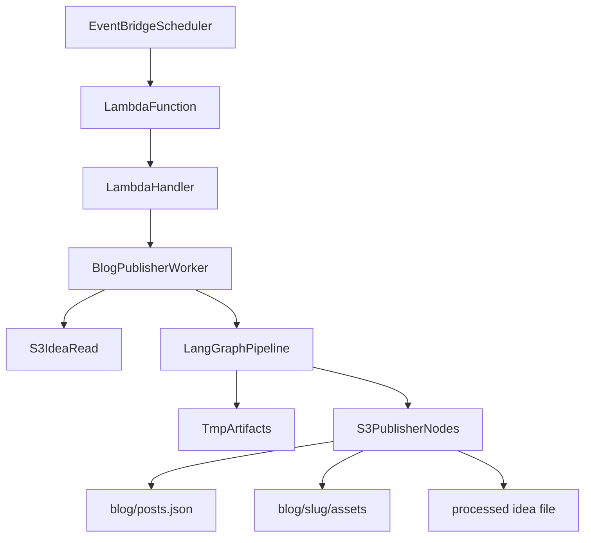

# Blog Publisher Deployment

This document describes the production deployment path for the Entourage blog publisher worker.

The primary deployment format is an AWS Lambda container image triggered by EventBridge Scheduler. The worker runs on demand, processes unprocessed S3 idea files, publishes generated assets back to S3, then exits. It is not an always-on FastAPI service.

## Architecture



## Runtime Entrypoints

Production Lambda handler:

```text
blog_manager.workers.lambda_handler.handler
```

Local or container CLI entrypoint:

```bash
python -m blog_manager.workers.run_blog_job --dry-run --max-ideas 1
```

`blog_manager/app.py` is intentionally dormant. It exists only as a marker for a possible future HTTP/dev-debug surface and is not used by Lambda infrastructure.

## Required AWS Resources

- ECR repository for the Lambda container image.
- Lambda function created from the ECR image.
- EventBridge Scheduler rule that invokes the Lambda function every 3 days.
- Lambda execution role with least-privilege S3 access to the blog keys.
- CloudWatch Logs for Lambda stdout/stderr.

## Environment Variables

Use `.env.example` as the source list for configuration names. In Lambda, configure these as function environment variables or through your secret-management workflow.

Required storage settings:

```text
BLOG_S3_BUCKET=<website-bucket>
BLOG_IDEAS_PREFIX=blog/ideas/
BLOG_POSTS_FEED_KEY=blog/posts.json
BLOG_POSTS_PREFIX=blog/
BLOG_LOCAL_WORK_ROOT=/tmp/blog-work
BLOG_MAX_IDEAS_PER_RUN=1
BLOG_DRY_RUN=true
BLOG_OVERWRITE_EXISTING=false
AWS_REGION=us-east-1
```

Required model/provider settings:

```text
BLOG_PIPELINE_TOGETHER_MODEL=<reasoning-model>
BLOG_EXPANSION_TOGETHER_MODEL=<writing-model>
BLOG_SUBAGENT_TOGETHER_MODEL=<lightweight-subagent-model>
BLOG_TOGETHER_API_KEY=<secret>
```

HuggingFace fallback variables are optional but recommended if Together is unavailable. Image generation settings depend on the final image provider. `BLOG_IMAGE_PROVIDER=placeholder` is useful only for dry-run plumbing.

## IAM Policy Shape

Attach a policy like this to the Lambda execution role, replacing bucket names and prefixes.

```json
{
  "Version": "2012-10-17",
  "Statement": [
    {
      "Sid": "ListBlogIdeaPrefix",
      "Effect": "Allow",
      "Action": ["s3:ListBucket"],
      "Resource": "arn:aws:s3:::YOUR_BUCKET",
      "Condition": {
        "StringLike": {
          "s3:prefix": ["blog/ideas/*", "blog/posts.json", "blog/*"]
        }
      }
    },
    {
      "Sid": "ReadBlogInputs",
      "Effect": "Allow",
      "Action": ["s3:GetObject"],
      "Resource": [
        "arn:aws:s3:::YOUR_BUCKET/blog/ideas/*",
        "arn:aws:s3:::YOUR_BUCKET/blog/posts.json"
      ]
    },
    {
      "Sid": "WriteBlogOutputs",
      "Effect": "Allow",
      "Action": ["s3:PutObject"],
      "Resource": [
        "arn:aws:s3:::YOUR_BUCKET/blog/ideas/*",
        "arn:aws:s3:::YOUR_BUCKET/blog/posts.json",
        "arn:aws:s3:::YOUR_BUCKET/blog/*/index.html",
        "arn:aws:s3:::YOUR_BUCKET/blog/*/cover.jpg"
      ]
    }
  ]
}
```

The subagents never receive AWS credentials or an S3 client. S3 access is centralized in `S3BlogStore` and publisher graph nodes.

## Build And Push

From the repository root:

```bash
aws ecr create-repository --repository-name entourage-blog-publisher
```

```bash
aws ecr get-login-password --region us-east-1 \
  | docker login --username AWS --password-stdin <account-id>.dkr.ecr.us-east-1.amazonaws.com
```

Build and push a Lambda-compatible single-platform image. The `--provenance=false` flag is important because Lambda rejects Buildx's default OCI index/provenance attestation output.

```bash
docker buildx build \
  --platform linux/amd64 \
  --provenance=false \
  -f Dockerfile.lambda \
  -t 169615917687.dkr.ecr.us-east-1.amazonaws.com/entourage-blog-publisher:latest \
  --push \
  .
```

If deploying in `ap-southeast-1`, use the same region in both the ECR URI and AWS CLI commands:

```bash
docker buildx build \
  --platform linux/amd64 \
  --provenance=false \
  -f Dockerfile.lambda \
  -t 169615917687.dkr.ecr.ap-southeast-1.amazonaws.com/entourage-blog-publisher:latest \
  --push \
  .
```

Verify the pushed image media type before deploying to Lambda:

```bash
docker buildx imagetools inspect <account-id>.dkr.ecr.ap-southeast-1.amazonaws.com/entourage-blog-publisher:latest
```

Avoid images whose top-level media type is `application/vnd.oci.image.index.v1+json`.

## Lambda Setup

Create the function from the ECR image:

```bash
aws lambda create-function \
  --function-name entourage-blog-publisher \
  --package-type Image \
  --code ImageUri=<account-id>.dkr.ecr.us-east-1.amazonaws.com/entourage-blog-publisher:latest \
  --role arn:aws:iam::<account-id>:role/<lambda-execution-role> \
  --timeout 900 \
  --memory-size 2048
```

For later deployments:

```bash
aws lambda update-function-code \
  --function-name entourage-blog-publisher \
  --image-uri <account-id>.dkr.ecr.us-east-1.amazonaws.com/entourage-blog-publisher:latest
```

Start with `BLOG_DRY_RUN=true`. Switch to `BLOG_DRY_RUN=false` only after a successful dry-run log review.

## EventBridge Schedule

Use EventBridge Scheduler with a 3-day cadence. A rate expression is enough for the current workflow:

```bash
aws scheduler create-schedule \
  --name entourage-blog-publisher-every-3-days \
  --schedule-expression "rate(3 days)" \
  --flexible-time-window Mode=OFF \
  --target '{
    "Arn": "arn:aws:lambda:us-east-1:<account-id>:function:entourage-blog-publisher",
    "RoleArn": "arn:aws:iam::<account-id>:role/<scheduler-invoke-role>",
    "Input": "{\"max_ideas\":1}"
  }'
```

The scheduler invoke role must be allowed to call `lambda:InvokeFunction` on the blog publisher function.

## Rollout Checklist

1. Build and push the Lambda image.
2. Create or update the Lambda function.
3. Configure environment variables with `BLOG_DRY_RUN=true`.
4. Invoke manually with one test idea file.
5. Review CloudWatch Logs for generated slug, artifact validation, and skipped S3 writes.
6. Set `BLOG_DRY_RUN=false`.
7. Invoke manually once.
8. Confirm `blog/posts.json`, `blog/<slug>/index.html`, `blog/<slug>/cover.jpg`, and the source idea metadata in S3.
9. Enable the EventBridge schedule.

## Monitoring

Watch CloudWatch Logs for:

- run start and `max_ideas`
- number of unprocessed ideas found
- per-idea status: `published`, `dry_run`, or `failed`
- graph errors
- provider failures from Together, HuggingFace, or image generation

Operational alarm candidates:

- Lambda invocation errors greater than zero
- Lambda duration approaching 900 seconds
- no successful run over a 7-day window

## Rollback

Fast rollback options:

- Set `BLOG_DRY_RUN=true` to stop S3 writes while still exercising the pipeline.
- Disable the EventBridge schedule.
- Repoint Lambda to a previous ECR image tag with `aws lambda update-function-code`.
- If a generated post should be withdrawn, manually remove its feed entry from `blog/posts.json` and optionally remove `blog/<slug>/index.html` and `blog/<slug>/cover.jpg`.

Do not mark source ideas processed manually unless the corresponding post assets and feed entry are correct.

## Fargate Fallback

Use scheduled ECS Fargate instead of Lambda if dry-run or production runs approach Lambda's 15-minute timeout, require heavier native dependencies, or need more predictable long-running container behavior.

The application code should remain the same. The Fargate task can run:

```bash
python -m blog_manager.workers.run_blog_job --max-ideas 1
```

Keep the same S3 IAM boundary and environment variables. The main difference is the scheduler target and container runtime, not the pipeline code.
