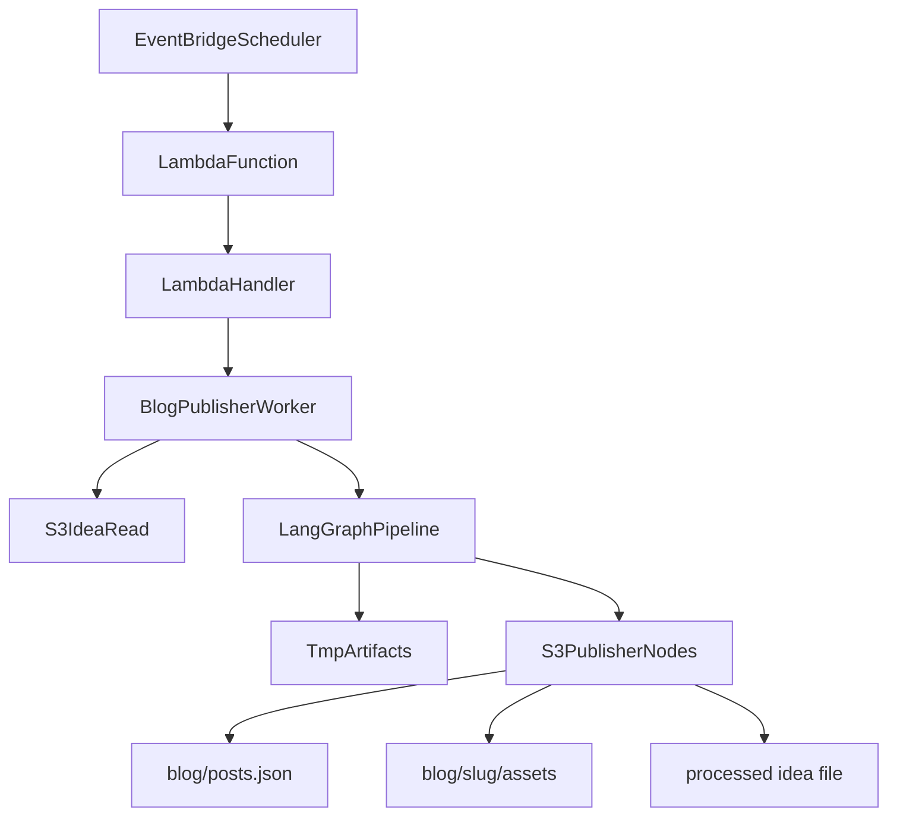
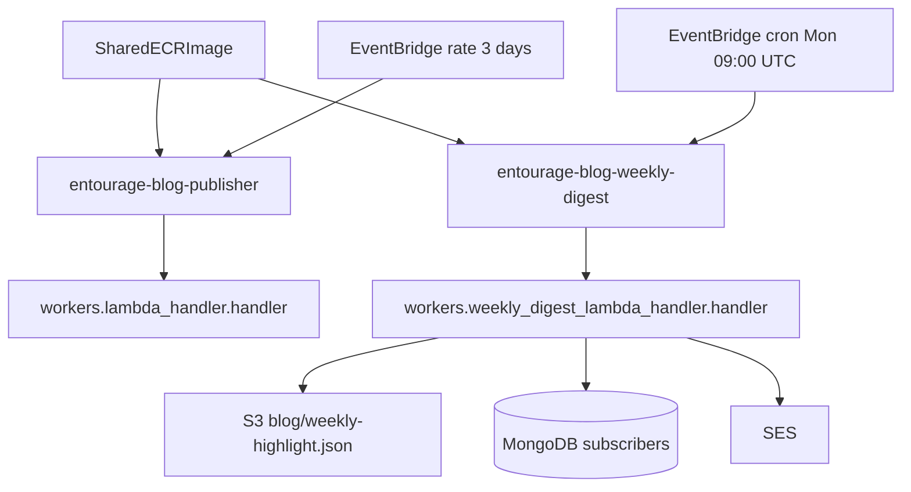
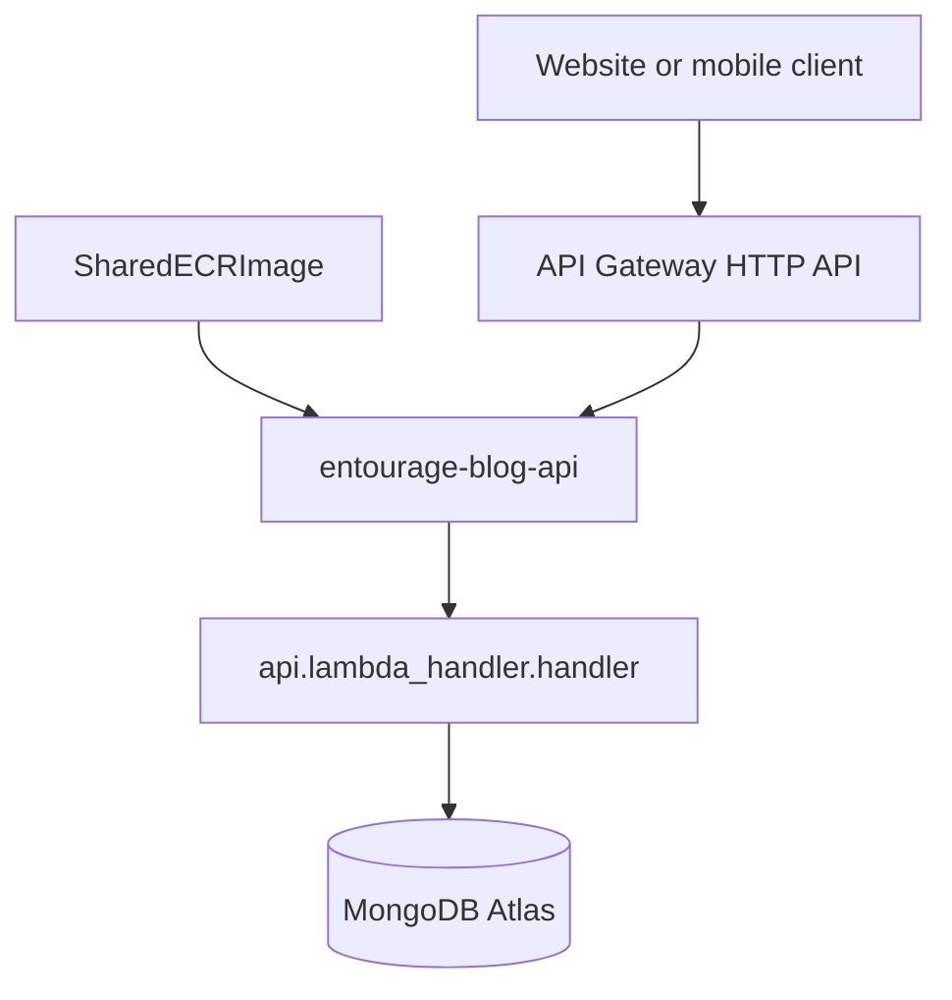

# Blog Publisher Deployment

This document describes the production deployment path for the Entourage blog publisher worker.

The primary deployment format is an AWS Lambda container image triggered by EventBridge Scheduler. The worker runs on demand, processes unprocessed S3 idea files, publishes generated assets back to S3, then exits. It is not an always-on FastAPI service.

## Architecture


```mermaid
flowchart TD
    EventBridgeScheduler[EventBridgeScheduler] --> LambdaFunction[LambdaFunction]
    LambdaFunction --> LambdaHandler[LambdaHandler]
    LambdaHandler --> Worker[BlogPublisherWorker]
    Worker --> S3IdeaRead[S3IdeaRead]
    Worker --> LangGraphPipeline[LangGraphPipeline]
    LangGraphPipeline --> TmpArtifacts[TmpArtifacts]
    LangGraphPipeline --> S3PublisherNodes[S3PublisherNodes]
    S3PublisherNodes --> PostsFeed["blog/posts.json"]
    S3PublisherNodes --> PostAssets["blog/slug/assets"]
    S3PublisherNodes --> ProcessedIdea["processed idea file"]
```

## Runtime Entrypoints

Production Lambda handler:

```text
blog_manager.workers.lambda_handler.handler
```

Local or container CLI entrypoint:

```bash
python -m blog_manager.workers.run_blog_job --dry-run --max-ideas 1
```

`blog_manager/app.py` is intentionally dormant. It exists only as a marker for a possible future HTTP/dev-debug surface and is not used by Lambda infrastructure.

## Required AWS Resources

- ECR repository for the Lambda container image.
- Lambda function created from the ECR image.
- EventBridge Scheduler rule that invokes the Lambda function every 3 days.
- Lambda execution role with least-privilege S3 access to the blog keys.
- CloudWatch Logs for Lambda stdout/stderr.

## Environment Variables

Use `.env.example` as the source list for configuration names. In Lambda, configure these as function environment variables or through your secret-management workflow.

Required storage settings:

```text
BLOG_S3_BUCKET=<website-bucket>
BLOG_IDEAS_PREFIX=blog/ideas/
BLOG_POSTS_FEED_KEY=blog/posts.json
BLOG_POSTS_PREFIX=blog/
BLOG_LOCAL_WORK_ROOT=/tmp/blog-work
BLOG_MAX_IDEAS_PER_RUN=1
BLOG_DRY_RUN=true
BLOG_OVERWRITE_EXISTING=false
AWS_REGION=us-east-1
```

Required model/provider settings:

```text
BLOG_PIPELINE_TOGETHER_MODEL=<reasoning-model>
BLOG_EXPANSION_TOGETHER_MODEL=<writing-model>
BLOG_SUBAGENT_TOGETHER_MODEL=<lightweight-subagent-model>
BLOG_TOGETHER_API_KEY=<secret>
```

HuggingFace fallback variables are optional but recommended if Together is unavailable. Image generation settings depend on the final image provider. `BLOG_IMAGE_PROVIDER=placeholder` is useful only for dry-run plumbing.

## IAM Policy Shape

Attach a policy like this to the Lambda execution role, replacing bucket names and prefixes.

```json
{
  "Version": "2012-10-17",
  "Statement": [
    {
      "Sid": "ListBlogIdeaPrefix",
      "Effect": "Allow",
      "Action": ["s3:ListBucket"],
      "Resource": "arn:aws:s3:::YOUR_BUCKET",
      "Condition": {
        "StringLike": {
          "s3:prefix": ["blog/ideas/*", "blog/posts.json", "blog/*"]
        }
      }
    },
    {
      "Sid": "ReadBlogInputs",
      "Effect": "Allow",
      "Action": ["s3:GetObject"],
      "Resource": [
        "arn:aws:s3:::YOUR_BUCKET/blog/ideas/*",
        "arn:aws:s3:::YOUR_BUCKET/blog/posts.json"
      ]
    },
    {
      "Sid": "WriteBlogOutputs",
      "Effect": "Allow",
      "Action": ["s3:PutObject"],
      "Resource": [
        "arn:aws:s3:::YOUR_BUCKET/blog/ideas/*",
        "arn:aws:s3:::YOUR_BUCKET/blog/posts.json",
        "arn:aws:s3:::YOUR_BUCKET/blog/*/index.html",
        "arn:aws:s3:::YOUR_BUCKET/blog/*/cover.jpg"
      ]
    }
  ]
}
```

The subagents never receive AWS credentials or an S3 client. S3 access is centralized in `S3BlogStore` and publisher graph nodes.

## Build And Push

From the repository root:

```bash
aws ecr create-repository --repository-name entourage-blog-publisher
```

```bash
aws ecr get-login-password --region us-east-1 \
  | docker login --username AWS --password-stdin <account-id>.dkr.ecr.us-east-1.amazonaws.com
```

Build and push a Lambda-compatible single-platform image. The `--provenance=false` flag is important because Lambda rejects Buildx's default OCI index/provenance attestation output.

```bash
docker buildx build \
  --platform linux/amd64 \
  --provenance=false \
  -f Dockerfile.lambda \
  -t 169615917687.dkr.ecr.us-east-1.amazonaws.com/entourage-blog-publisher:latest \
  --push \
  .
```

If deploying in `ap-southeast-1`, use the same region in both the ECR URI and AWS CLI commands:

```bash
docker buildx build \
  --platform linux/amd64 \
  --provenance=false \
  -f Dockerfile.lambda \
  -t 169615917687.dkr.ecr.ap-southeast-1.amazonaws.com/entourage-blog-publisher:latest \
  --push \
  .
```

Verify the pushed image media type before deploying to Lambda:

```bash
docker buildx imagetools inspect <account-id>.dkr.ecr.ap-southeast-1.amazonaws.com/entourage-blog-publisher:latest
```

Avoid images whose top-level media type is `application/vnd.oci.image.index.v1+json`.

## Lambda Setup

Create the function from the ECR image:

```bash
aws lambda create-function \
  --function-name entourage-blog-publisher \
  --package-type Image \
  --code ImageUri=<account-id>.dkr.ecr.us-east-1.amazonaws.com/entourage-blog-publisher:latest \
  --role arn:aws:iam::<account-id>:role/<lambda-execution-role> \
  --timeout 900 \
  --memory-size 2048
```

For later deployments:

```bash
aws lambda update-function-code \
  --function-name entourage-blog-publisher \
  --image-uri <account-id>.dkr.ecr.us-east-1.amazonaws.com/entourage-blog-publisher:latest
```

Start with `BLOG_DRY_RUN=true`. Switch to `BLOG_DRY_RUN=false` only after a successful dry-run log review.

## EventBridge Schedule

Use EventBridge Scheduler with a 3-day cadence. A rate expression is enough for the current workflow:

```bash
aws scheduler create-schedule \
  --name entourage-blog-publisher-every-3-days \
  --schedule-expression "rate(3 days)" \
  --flexible-time-window Mode=OFF \
  --target '{
    "Arn": "arn:aws:lambda:us-east-1:<account-id>:function:entourage-blog-publisher",
    "RoleArn": "arn:aws:iam::<account-id>:role/<scheduler-invoke-role>",
    "Input": "{\"max_ideas\":1}"
  }'
```

The scheduler invoke role must be allowed to call `lambda:InvokeFunction` on the blog publisher function.

## Weekly Digest Lambda

The weekly digest uses the **same ECR image** as the blog publisher. Create a second Lambda function and override the container entrypoint with `ImageConfig.Command`. The publisher `Dockerfile.lambda` `CMD` stays unchanged.


```mermaid
flowchart TD
    SharedImage[SharedECRImage] --> PublisherLambda[entourage-blog-publisher]
    SharedImage --> DigestLambda[entourage-blog-weekly-digest]

    PublisherSchedule[EventBridge rate 3 days] --> PublisherLambda
    DigestSchedule[EventBridge cron Mon 09:00 UTC] --> DigestLambda

    PublisherLambda --> PublisherHandler[workers.lambda_handler.handler]
    DigestLambda --> DigestHandler[workers.weekly_digest_lambda_handler.handler]

    DigestHandler --> S3Highlight["S3 blog/weekly-highlight.json"]
    DigestHandler --> MongoDB[(MongoDB subscribers)]
    DigestHandler --> SES[SES]
```

### Runtime Entrypoints

Weekly digest Lambda handler:

```text
blog_manager.workers.weekly_digest_lambda_handler.handler
```

Local or container CLI entrypoint:

```bash
python -m blog_manager.workers.run_weekly_digest_job
```

### Required AWS Resources

- Same ECR repository and image artifact as the blog publisher.
- Second Lambda function: `entourage-blog-weekly-digest`.
- Second EventBridge Scheduler rule: `entourage-blog-weekly-digest-monday`.
- Separate Lambda execution role with digest-only permissions (no LLM or S3 write access).
- SES verified sender domain or email address.
- MongoDB Atlas reachable from Lambda. Use an Atlas IP allowlist for Lambda egress, or VPC plus NAT if you require private networking.

### Environment Variables

The digest Lambda does not need Together, HuggingFace, or image-generation variables. Configure:

```text
BLOG_S3_BUCKET=<website-bucket>
BLOG_WEEKLY_HIGHLIGHT_KEY=blog/weekly-highlight.json
BLOG_API_MONGODB_URI=<atlas-uri-without-credentials>
BLOG_API_MONGODB_USERNAME=<atlas-user>
BLOG_API_MONGODB_PASSWORD=<atlas-password>
BLOG_API_MONGODB_DATABASE=entourage_blog
BLOG_API_SES_SENDER_EMAIL=<verified-sender>
BLOG_API_SES_CONFIGURATION_SET=<optional>
AWS_REGION=ap-southeast-1
```

### IAM Policy Shape

Attach a policy like this to the weekly digest execution role, replacing bucket names and sender identity as needed.

```json
{
  "Version": "2012-10-17",
  "Statement": [
    {
      "Sid": "ReadWeeklyHighlight",
      "Effect": "Allow",
      "Action": ["s3:GetObject"],
      "Resource": "arn:aws:s3:::YOUR_BUCKET/blog/weekly-highlight.json"
    },
    {
      "Sid": "SendDigestEmail",
      "Effect": "Allow",
      "Action": ["ses:SendEmail", "ses:SendRawEmail"],
      "Resource": "*"
    }
  ]
}
```

Restrict the SES statement to your verified identity ARN when possible. Do not grant `s3:PutObject` or idea-prefix access to this role.

### Lambda Setup

Create the digest function from the same ECR image and override the handler:

```bash
aws lambda create-function \
  --function-name entourage-blog-weekly-digest \
  --package-type Image \
  --code ImageUri=<account-id>.dkr.ecr.ap-southeast-1.amazonaws.com/entourage-blog-publisher:latest \
  --role arn:aws:iam::<account-id>:role/<weekly-digest-execution-role> \
  --timeout 300 \
  --memory-size 512 \
  --image-config '{"Command":["blog_manager.workers.weekly_digest_lambda_handler.handler"]}'
```

For later image deployments, update code the same way as the publisher:

```bash
aws lambda update-function-code \
  --function-name entourage-blog-weekly-digest \
  --image-uri <account-id>.dkr.ecr.ap-southeast-1.amazonaws.com/entourage-blog-publisher:latest
```

If the handler path ever changes, update the function configuration explicitly:

```bash
aws lambda update-function-configuration \
  --function-name entourage-blog-weekly-digest \
  --image-config '{"Command":["blog_manager.workers.weekly_digest_lambda_handler.handler"]}'
```

### EventBridge Schedule

Use EventBridge Scheduler with a weekly cron expression. Monday 09:00 UTC is the default:

```bash
aws scheduler create-schedule \
  --name entourage-blog-weekly-digest-monday \
  --schedule-expression "cron(0 9 ? * MON *)" \
  --schedule-expression-timezone "UTC" \
  --flexible-time-window Mode=OFF \
  --target '{
    "Arn": "arn:aws:lambda:ap-southeast-1:<account-id>:function:entourage-blog-weekly-digest",
    "RoleArn": "arn:aws:iam::<account-id>:role/<scheduler-invoke-role>"
  }'
```

The scheduler invoke role must be allowed to call `lambda:InvokeFunction` on the weekly digest function.

### Weekly Digest Rollout Checklist

1. Ensure the publisher has written `blog/weekly-highlight.json` at least once.
2. Build and push the Lambda image using the same build command as the publisher.
3. Create the digest Lambda with handler override and digest environment variables.
4. Confirm SES sender verification and MongoDB connectivity from Lambda.
5. Seed at least one confirmed subscriber in Mongo through the blog API.
6. Invoke the digest function manually and review CloudWatch Logs for `attempted`, `sent`, and `skipped`.
7. Invoke again to confirm deduplication (`skipped` increases, no duplicate emails).
8. Enable the Monday EventBridge schedule.

### Weekly Digest Monitoring

Watch CloudWatch Logs for:

- highlight slug loaded from S3
- `attempted`, `sent`, and `skipped` counts
- SES `MessageId` values for successful sends
- MongoDB connection failures
- missing or invalid `blog/weekly-highlight.json`

Operational alarm candidates:

- digest Lambda invocation errors greater than zero
- zero `sent` when confirmed subscribers exist and the highlight slug changed
- no successful digest run over a 10-day window

### Weekly Digest Rollback

Fast rollback options:

- Disable the weekly digest EventBridge schedule.
- Repoint the digest Lambda to a previous ECR image tag with `aws lambda update-function-code`.
- Rollback does not affect the blog publisher Lambda or its schedule.

### Idempotency

Digest sends are deduplicated per `(email, highlight_slug)` in `blog_digest_sends`. Lambda retries or duplicate schedule invocations for the same highlight slug will not resend to subscribers who already received that slug.

If no new post is published during the week, `blog/weekly-highlight.json` may keep the same slug. In that case the weekly job still runs, but all confirmed subscribers are reported as `skipped`. That is expected with the current slug-based dedup logic.

## Blog API Lambda

The public blog FastAPI service uses the **same ECR image** with a third handler override. Expose it through **API Gateway HTTP API** (or a Lambda function URL). No EventBridge schedule is required.


```mermaid
flowchart TD
    SharedImage[SharedECRImage] --> ApiLambda[entourage-blog-api]
    Client[Website or mobile client] --> HttpApi[API Gateway HTTP API]
    HttpApi --> ApiLambda
    ApiLambda --> ApiHandler[api.lambda_handler.handler]
    ApiHandler --> MongoDB[(MongoDB Atlas)]
```

### Runtime Entrypoints

Blog API Lambda handler (Mangum ASGI adapter):

```text
blog_manager.api.lambda_handler.handler
```

Local development with uvicorn:

```bash
uvicorn blog_manager.api.app:get_app --factory --reload --port 8080
```

### Required AWS Resources

- Same ECR repository and image artifact as the publisher and digest Lambdas.
- Third Lambda function: `entourage-blog-api`.
- API Gateway HTTP API with a `$default` stage, or a Lambda function URL.
- Lambda execution role with Mongo connectivity over the public internet (no VPC required when Atlas allows `0.0.0.0/0` with SCRAM auth).
- Optional SES permissions if you later wire confirmation emails through the API.

### Environment Variables

The API Lambda does not need Together, HuggingFace, image-generation, or publisher S3 variables. Configure:

```text
BLOG_API_JWT_SECRET=<long-random-secret>
BLOG_API_JWT_ALGORITHM=HS256
BLOG_API_ACCESS_TOKEN_TTL_MINUTES=60
BLOG_API_CORS_ORIGINS=https://www.entourage-ai.life
BLOG_API_BASE_URL=https://<api-id>.execute-api.ap-southeast-1.amazonaws.com
BLOG_API_MONGODB_URI=<atlas-uri-without-credentials>
BLOG_API_MONGODB_USERNAME=<atlas-user>
BLOG_API_MONGODB_PASSWORD=<atlas-password>
BLOG_API_MONGODB_DATABASE=entourage_blog
BLOG_API_SES_SENDER_EMAIL=<verified-sender>
BLOG_API_SES_CONFIGURATION_SET=<optional>
AWS_REGION=ap-southeast-1
```

Set `BLOG_API_BASE_URL` to the public HTTP API base URL (no trailing slash). Subscription confirmation emails embed `/blog/subscribers/confirm?token=...` links using this value. If it is unset, the API falls back to `X-Forwarded-*` headers from API Gateway.

### IAM Policy Shape

MongoDB access uses credentials in environment variables, not IAM. The execution role needs CloudWatch Logs. Add SES `SendEmail` / `SendRawEmail` because subscription confirmation emails are sent from `POST /blog/subscribers`.

```json
{
  "Version": "2012-10-17",
  "Statement": [
    {
      "Sid": "CloudWatchLogs",
      "Effect": "Allow",
      "Action": [
        "logs:CreateLogGroup",
        "logs:CreateLogStream",
        "logs:PutLogEvents"
      ],
      "Resource": "arn:aws:logs:ap-southeast-1:<account-id>:*"
    },
    {
      "Sid": "SendSubscriberEmail",
      "Effect": "Allow",
      "Action": ["ses:SendEmail", "ses:SendRawEmail"],
      "Resource": "*"
    }
  ]
}
```

Restrict the SES statement to your verified identity ARN when possible.

### Lambda Setup

Create the API function from the same ECR image and override the handler:

```bash
aws lambda create-function \
  --function-name entourage-blog-api \
  --package-type Image \
  --code ImageUri=<account-id>.dkr.ecr.ap-southeast-1.amazonaws.com/entourage-blog-publisher:latest \
  --role arn:aws:iam::<account-id>:role/<blog-api-execution-role> \
  --timeout 30 \
  --memory-size 512 \
  --image-config '{"Command":["blog_manager.api.lambda_handler.handler"]}'
```

For later image deployments:

```bash
aws lambda update-function-code \
  --function-name entourage-blog-api \
  --image-uri <account-id>.dkr.ecr.ap-southeast-1.amazonaws.com/entourage-blog-publisher:latest
```

### API Gateway HTTP API

Create an HTTP API and route all paths to the Lambda:

```bash
aws apigatewayv2 create-api \
  --name entourage-blog-api \
  --protocol-type HTTP \
  --cors-configuration AllowOrigins="https://www.entourage-ai.life",AllowMethods="GET,POST,OPTIONS",AllowHeaders="authorization,content-type",AllowCredentials=true

API_ID=<returned-api-id>

aws lambda add-permission \
  --function-name entourage-blog-api \
  --statement-id apigateway-invoke \
  --action lambda:InvokeFunction \
  --principal apigateway.amazonaws.com \
  --source-arn "arn:aws:execute-api:ap-southeast-1:${ACCOUNT_ID}:${API_ID}/*/*"

INTEGRATION_ID=$(aws apigatewayv2 create-integration \
  --api-id "${API_ID}" \
  --integration-type AWS_PROXY \
  --integration-uri "arn:aws:lambda:ap-southeast-1:${ACCOUNT_ID}:function:entourage-blog-api" \
  --payload-format-version 2.0 \
  --query IntegrationId --output text)

aws apigatewayv2 create-route \
  --api-id "${API_ID}" \
  --route-key "ANY /{proxy+}" \
  --target "integrations/${INTEGRATION_ID}"

aws apigatewayv2 create-route \
  --api-id "${API_ID}" \
  --route-key "ANY /" \
  --target "integrations/${INTEGRATION_ID}"

aws apigatewayv2 create-stage \
  --api-id "${API_ID}" \
  --stage-name '$default' \
  --auto-deploy
```

The invoke URL is:

```text
https://<api-id>.execute-api.ap-southeast-1.amazonaws.com/blog/health
```

Set `BLOG_API_BASE_URL` and `BLOG_API_CORS_ORIGINS` to match this URL and your website origin.

### Alternative: Lambda Function URL

For a simpler setup without API Gateway:

```bash
aws lambda create-function-url-config \
  --function-name entourage-blog-api \
  --auth-type NONE \
  --cors 'AllowOrigins=["https://www.entourage-ai.life"],AllowMethods=["GET","POST","OPTIONS"],AllowHeaders=["authorization","content-type"],AllowCredentials=true'
```

Use the returned function URL as `BLOG_API_BASE_URL`. API Gateway is preferred for custom domains and WAF.

### Blog API Rollout Checklist

1. Build and push the shared Lambda image.
2. Create the API Lambda with handler override and environment variables.
3. Confirm Atlas network access allows Lambda egress (`0.0.0.0/0` with SCRAM is sufficient for non-VPC Lambda).
4. Create the HTTP API (or function URL) and grant API Gateway invoke permission on the Lambda.
5. Call `GET /blog/health` and expect `{"ok": true, "service": "blog-api"}`.
6. Exercise auth, comments, and subscriber routes against Mongo.
7. Point the static website JavaScript at the API base URL for comments and subscriptions.

### Static website auth and comments rollout

Deploy these files from `agents_army_chief_and_managers/website/` to the public S3 website bucket:

- `blogs.html` — blog index with auth banner (`View as Guest` / `View as {username}`)
- `blog/blog-client.js` and `blog/blog-client.css` — shared API client (auth session, subscribe, comments)
- `blog/login.html`, `blog/register.html`, `blog/verify-email.html` — account lifecycle pages

Generated article HTML (`blog/{slug}/index.html`) references `../blog-client.js` and loads nested comments from `GET /blog/posts/{slug}/comments`. Republish or regenerate articles after updating `local_artifact_service.py` so existing S3 posts pick up the comments UI.

Manual smoke test:

1. Open `blogs.html` as a guest and confirm login/register links appear.
2. Register, verify email via `blog/verify-email.html`, then log in.
3. Open an article, post a top-level comment, reply once, and confirm reply-to-reply is blocked by the API.
4. Confirm pending comments show a submission message but do not appear publicly until approved.


Watch CloudWatch Logs for:

- `GET /blog/health` availability
- `401` / `403` spikes on protected routes
- Mongo connection or authentication failures
- unhandled FastAPI exceptions

Operational alarm candidates:

- API Lambda errors greater than zero over 5 minutes
- elevated `5xx` rate from API Gateway

### Blog API Rollback

- Repoint the Lambda to a previous ECR image tag.
- Roll back API Gateway stage deployment or disable the function URL.
- Rollback does not affect publisher or digest Lambdas.

## Rollout Checklist

1. Build and push the Lambda image.
2. Create or update the Lambda function.
3. Configure environment variables with `BLOG_DRY_RUN=true`.
4. Invoke manually with one test idea file.
5. Review CloudWatch Logs for generated slug, artifact validation, and skipped S3 writes.
6. Set `BLOG_DRY_RUN=false`.
7. Invoke manually once.
8. Confirm `blog/posts.json`, `blog/<slug>/index.html`, `blog/<slug>/cover.jpg`, and the source idea metadata in S3.
9. Enable the EventBridge schedule.

## Monitoring

Watch CloudWatch Logs for:

- run start and `max_ideas`
- number of unprocessed ideas found
- per-idea status: `published`, `dry_run`, or `failed`
- graph errors
- provider failures from Together, HuggingFace, or image generation

Operational alarm candidates:

- Lambda invocation errors greater than zero
- Lambda duration approaching 900 seconds
- no successful run over a 7-day window

## Rollback

Fast rollback options:

- Set `BLOG_DRY_RUN=true` to stop S3 writes while still exercising the pipeline.
- Disable the EventBridge schedule.
- Repoint Lambda to a previous ECR image tag with `aws lambda update-function-code`.
- If a generated post should be withdrawn, manually remove its feed entry from `blog/posts.json` and optionally remove `blog/<slug>/index.html` and `blog/<slug>/cover.jpg`.

Do not mark source ideas processed manually unless the corresponding post assets and feed entry are correct.

## Fargate Fallback

Use scheduled ECS Fargate instead of Lambda if dry-run or production runs approach Lambda's 15-minute timeout, require heavier native dependencies, or need more predictable long-running container behavior.

The application code should remain the same. The Fargate task can run:

```bash
python -m blog_manager.workers.run_blog_job --max-ideas 1
```

Keep the same S3 IAM boundary and environment variables. The main difference is the scheduler target and container runtime, not the pipeline code.
