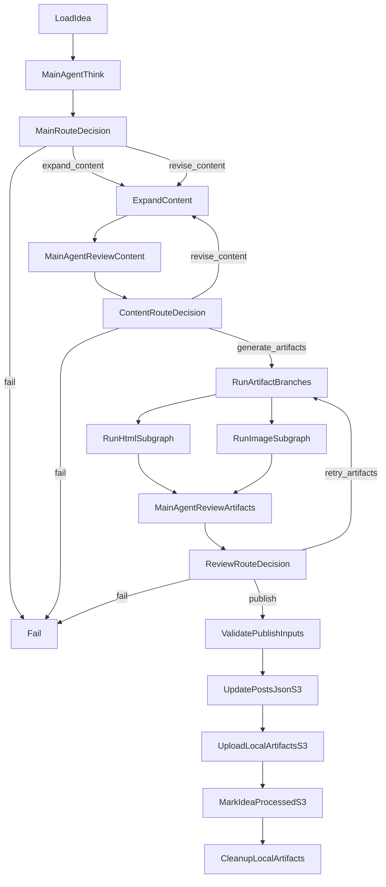
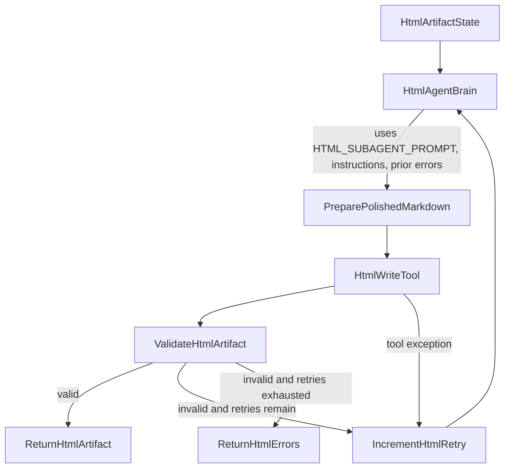
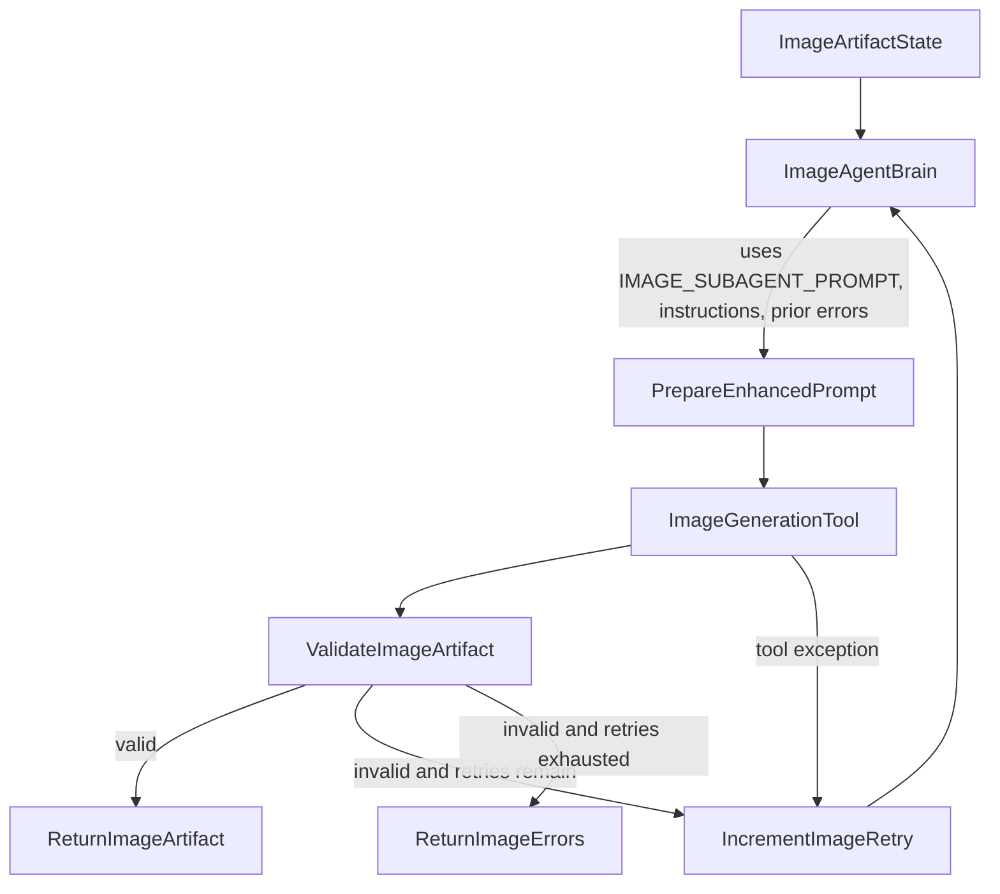

# Blog Publisher Pipeline

This repository contains the Entourage blog publisher agent. Its job is to turn rough blog ideas from S3 into complete static website assets:

- updated `blog/posts.json` metadata
- one generated blog article HTML file
- one generated cover image
- an updated source idea file marked as processed

The system is designed as a small agent team. One supervisor decides what should happen next, one writing agent expands the post, and two artifact agents produce local HTML/image files. Only the main publisher workflow is allowed to write to S3.

## High-Level Flow

At a high level, one scheduled worker run should:

1. Read unprocessed `blog/ideas/idea_<n>.md` files from S3.
2. Ask the pipeline supervisor what to do.
3. Expand or revise the rough idea into a structured post.
4. Review the post and decide whether artifacts can be generated.
5. Generate HTML and image artifacts locally in parallel.
6. Review and validate local artifacts.
7. Update `blog/posts.json` in S3.
8. Upload the local HTML and image files to S3.
9. Overwrite the original idea file in S3 with `processed: true`.
10. Clean up local artifacts after successful upload.

The current worker entrypoint can run the pipeline as a one-shot job for CLI or Lambda use. The graph code is available in `blog_manager/graphs/blog_generation_graph.py`, and deployment steps are documented in `DEPLOYMENT.md`.

## Top-Level Diagram



## Agent Roles

### BlogPipelineAgent

`BlogPipelineAgent` is the supervisor. It follows a bounded ReAct-style pattern:

- observe graph state
- reason privately
- return one strict JSON decision

It does not write the blog post, render HTML, generate images, call subagent tools, or call S3. It only decides which graph path should run next.

### BlogExpansionAgent

`BlogExpansionAgent` is the content writer. It runs inside `ExpandContent` when the supervisor chooses either:

- `expand_content`
- `revise_content`

It uses its own writing prompt and produces `ExpandedPost`, including title, slug, date, excerpt, Markdown body, SEO metadata, safety notes, image brief, and subagent instructions.

### HtmlAgent

`HtmlAgent` is the HTML artifact specialist. It improves readability and presentation before writing local `index.html`.

It uses `HTML_SUBAGENT_PROMPT`, receives orchestrator instructions, and receives previous tool or validation errors on retry.

### ImageAgent

`ImageAgent` is the image artifact specialist. It turns the main post's visual brief into a better generation prompt and creates local `cover.jpg`.

It uses `IMAGE_SUBAGENT_PROMPT`, receives orchestrator instructions, and receives previous tool or validation errors on retry.

## ReAct Decisions

`BlogPipelineAgent` returns this decision shape:

```json
{
  "decision": "expand_content|revise_content|generate_artifacts|retry_artifacts|publish|fail",
  "reason": "short user-safe explanation",
  "content_revision_instruction": "string, optional",
  "artifact_retry_instruction": "string, optional"
}
```

Decision routing:

- `expand_content`: runs `BlogExpansionAgent` for the first full post draft.
- `revise_content`: runs `BlogExpansionAgent` again with `content_revision_instruction`.
- `generate_artifacts`: starts the parallel HTML and image branches.
- `retry_artifacts`: reruns artifact branches, passing previous validation/tool errors back into subagents.
- `publish`: validates local artifacts, then enters main-only S3 publishing nodes.
- `fail`: stops the workflow and records the reason.

Loop limits prevent a cron job from running forever:

- `BLOG_MAIN_AGENT_MAX_ROUNDS`, default `3`
- `BLOG_SUBAGENT_MAX_RETRIES`, default `2`

## HTML Artifact Branch

`run_html_subgraph` is implemented as a retryable workflow method. It is not currently a separately compiled nested `StateGraph`, but it preserves the intended subgraph responsibilities.



HTML responsibilities:

- use `HTML_SUBAGENT_PROMPT`
- improve web readability and accessibility
- normalize paragraph spacing, heading flow, and list formatting
- preserve core meaning and avoid new claims
- write only local `index.html`
- return validation errors to `MainAgentReviewArtifacts`

Validation expects:

- content type: `text/html; charset=utf-8`
- relative key: `blog/<slug>/index.html`
- local file exists under configured local work root

## Image Artifact Branch

`run_image_subgraph` is also implemented as a retryable workflow method.



Image responsibilities:

- use `IMAGE_SUBAGENT_PROMPT`
- produce exactly one cover image for the current website contract
- enhance the visual brief with composition, palette, lighting, style, and safety constraints
- avoid text inside the image, recognizable real people, medical imagery, copyrighted characters, and fear-based visuals
- write only local `cover.jpg`
- return validation errors to `MainAgentReviewArtifacts`

Validation expects:

- content type: `image/jpeg`
- relative key: `blog/<slug>/cover.jpg`
- local file exists under configured local work root

## Shared LLM Client

All agents use the same `BlogLlmClient` class in `blog_manager/services/llm_client.py`.

That class provides consistent Together-first, HuggingFace-fallback behavior. The agents differ by the config passed to each client instance:

- `PIPELINE_LLM_CONFIG`: used by `BlogPipelineAgent`; tuned for routing/reasoning, lower default temperature.
- `EXPANSION_LLM_CONFIG`: used by `BlogExpansionAgent`; tuned for writing and creative structure.
- `SUBAGENT_LLM_CONFIG`: used by `HtmlAgent` and `ImageAgent`; tuned for lightweight preparation before local tool invocation.

Each role-specific config supports:

- `*_TOGETHER_MODEL`
- `*_HF_MODEL`
- `*_HF_PROVIDER`
- `*_HF_FALLBACK_MODEL_IDS`
- `*_LLM_MAX_TOKENS`
- `*_LLM_TEMPERATURE`
- `*_LLM_TOP_P`
- `*_LLM_TIMEOUT_SEC`

This keeps provider behavior consistent while allowing different models for different agent skills.

## Permission Boundaries

S3 writes are restricted to publisher nodes in `BlogGenerationWorkflow`:

- `update_feed`
- `upload_assets`
- `mark_processed`

Subagents receive local-only tools:

- `HtmlAgent` uses `HtmlWriteTool`
- `ImageAgent` uses `ImageGenerationTool`
- both tools use `LocalArtifactService`

No subagent receives `S3BlogStore`, a boto3 client, or bucket credentials.

## S3 Publishing Order

Publishing happens only after `MainAgentReviewArtifacts` chooses `publish` and local artifact validation passes.

The order is:

1. `update_feed`: append/dedupe/sort metadata in `blog/posts.json`.
2. `upload_assets`: upload local `index.html` and `cover.jpg`.
3. `mark_processed`: overwrite the original S3 idea file with processed metadata.
4. `cleanup_local`: delete local artifacts after all S3 writes succeed.

If any step before `mark_processed` fails, the source idea remains unprocessed and can be retried later.

## Important Data Shapes

`ExpandedPost` is the content payload produced by `BlogExpansionAgent`.

`LocalArtifact` describes a local file that the main pipeline may upload later. Its `relative_key` is the destination S3 object key, such as:

- `blog/my-post/index.html`
- `blog/my-post/cover.jpg`

`BlogGraphState` carries the workflow state:

```python
main_round: int = 0
artifact_round: int = 0
main_decision: BlogPipelineDecision | None = None
html_retry_count: int = 0
image_retry_count: int = 0
publish_ready: bool = False
errors: list[str] = []
```

## Implementation Files

- `blog_manager/graphs/blog_generation_graph.py`: top-level workflow, retry loops, publisher nodes.
- `blog_manager/agents/blog_pipeline_agent.py`: ReAct supervisor prompt, observation payloads, decision parsing.
- `blog_manager/agents/blog_expansion_agent.py`: content expansion and revision.
- `blog_manager/agents/html_agent.py`: HTML subagent brain and local artifact creation.
- `blog_manager/agents/image_agent.py`: image subagent brain and local artifact creation.
- `blog_manager/services/local_artifact_service.py`: local file writes, artifact validation, cleanup helpers.
- `blog_manager/services/s3_blog_store.py`: S3 read/write adapter for main publisher nodes.
- `blog_manager/config/config.py`: storage, LLM, image, worker, and graph execution settings.
- `blog_manager/workers/run_blog_job.py`: reusable one-shot worker for CLI and Lambda.
- `blog_manager/workers/lambda_handler.py`: EventBridge/Lambda handler wrapper.
- `Dockerfile.lambda`: Lambda container image build file.
- `DEPLOYMENT.md`: ECR, Lambda, EventBridge, IAM, logs, rollback, and Fargate fallback guide.

## Deployment Summary

The primary deployment target is an EventBridge-scheduled Lambda container. This matches the expected cadence of one run every 3 days and avoids paying for idle EC2 capacity.

Production handler:

```text
blog_manager.workers.lambda_handler.handler
```

Local dry-run command:

```bash
python -m blog_manager.workers.run_blog_job --dry-run --max-ideas 1
```

Lambda uses `/tmp/blog-work` for local HTML and image artifacts. `blog_manager/app.py` is dormant and not part of the Lambda runtime path.

## Current Limitations

- HTML and image branches are retryable workflow methods, not independently compiled nested `StateGraph`s.
- Real image provider integration is still configurable/future work. `BLOG_IMAGE_PROVIDER=placeholder` exists for local plumbing.
- End-to-end tests with mocked S3, LLM, and image providers are still pending.
